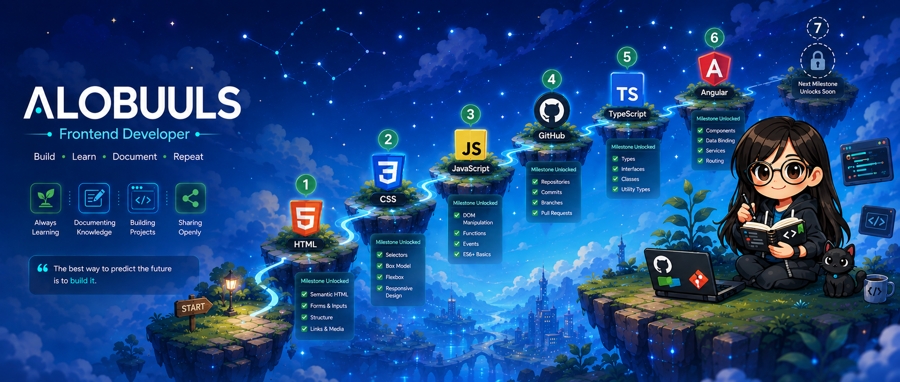

<p align="center">
  
</p>

<h1 align="center">
  
</h1>

<p align="center"><a href="https://github.com/alobuuls"></a><a href="https://www.linkedin.com/in/alobuuls"></a><a href="https://codepen.io/alobuuls"></a></p>

<br/>

---

### 🙋‍♀️ About Me

```ts
const alondra = {
  role: "Frontend Developer",
  stack: ["Angular", "TypeScript", "JavaScript", "Git"],
  interests: ["Frontend Architecture", "Developer Tools", "Open Source"],
  currentlyLearning: ["Testing", "Software Architecture", "Performance"],
  mission: "Document what I learn and share the journey",
  motto: "Code it → Understand it → Document it → Repeat 📚",
};
```

---

### 🛠️ Tech Stack

<p align="center">
  
</p>

---

### 🚀 Featured Projects

<table>
  <tr>
    <td width="50%" valign="top">
      <h3>🔔 Free Alerts</h3>
      <p>Lightweight JS library for toasts, alerts & confirmations. Clean API, zero dependencies, drop-in ready.</p>
      <p><sub><strong>JavaScript · npm</strong></sub></p>
      <a href="https://github.com/alobuuls/free-alerts"></a>
    </td>
    <td width="50%" valign="top">
      <h3>⌨️ Typing Speed Test</h3>
      <p>Measures WPM, accuracy, and performance in real time. Instant feedback, smooth UX.</p>
      <p><sub><strong>HTML · CSS · JavaScript</strong></sub></p>
      <a href="https://github.com/alobuuls/typing-speed-test"></a>
    </td>
  </tr>
  <tr>
    <td width="50%" valign="top">
      <h3>📸 Unsplash Angular Gallery</h3>
      <p>Image explorer with pagination & infinite scroll. Built with RxJS, HTTP interceptors, and clean architecture.</p>
      <p><sub><strong>Angular · TypeScript · RxJS</strong></sub></p>
      <a href="https://github.com/alobuuls/unsplash-angular-gallery"></a>
    </td>
    <td width="50%" valign="top">
      <h3>📋 Angular Kanban Board</h3>
      <p>Drag & drop Kanban with Angular CDK. Full task and column reordering, responsive layout.</p>
      <p><sub><strong>Angular · TypeScript · Angular CDK</strong></sub></p>
      <a href="https://github.com/alobuuls/angular-kanban-drag-drop"></a>
    </td>
  </tr>
  <tr>
    <td colspan="2" valign="top">
      <h3>🎨 Landing Page</h3>
      <p>Modern, responsive landing for a home products brand — product showcase, contact section, and international reach.</p>
      <p><sub><strong>HTML · CSS · JavaScript</strong></sub></p>
      <a href="https://github.com/alobuuls/landing-page"></a>
    </td>
  </tr>
</table>

---

### 📈 Developer Journey

<table>
  <tr>
    <td align="center"><strong>🌱 Foundations</strong></td>
    <td align="center">→</td>
    <td align="center"><strong>⚙️ Craft</strong></td>
    <td align="center">→</td>
    <td align="center"><strong>🏗️ Engineering</strong></td>
    <td align="center">→</td>
    <td align="center"><strong>🚀 Shipping</strong></td>
  </tr>
  <tr>
    <td align="center"><sub>HTML · CSS · JS</sub></td>
    <td></td>
    <td align="center"><sub>TypeScript · Angular · RxJS</sub></td>
    <td></td>
    <td align="center"><sub>Architecture · Testing · Git</sub></td>
    <td></td>
    <td align="center"><sub>Build · Document · Share</sub></td>
  </tr>
</table>

---

### 📖 Currently Exploring

<table>
  <tr>
    <td width="33%" align="center">
      <h4>🅰️ Frontend</h4>
      
      
      
    </td>
    <td width="33%" align="center">
      <h4>🏗️ Engineering</h4>
      
      
      
    </td>
    <td width="33%" align="center">
      <h4>🔧 Tooling</h4>
      
      
      
    </td>
  </tr>
</table>

---

### 📊 GitHub Stats
<p align="center">
  
  &nbsp;
  
</p>
<p align="center">
  
  &nbsp;
  
</p>

---

<p align="center">
  <sub>📚 <strong>Build · Learn · Document · Repeat</strong></sub>
</p>